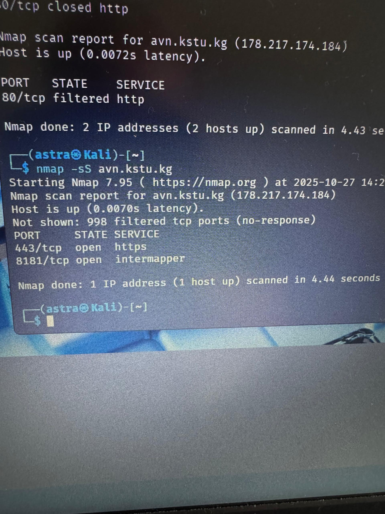
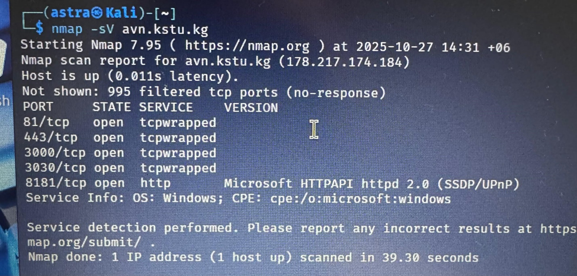
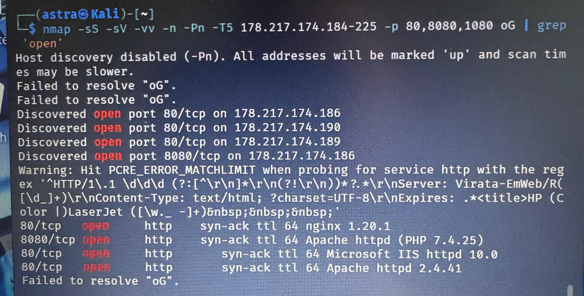
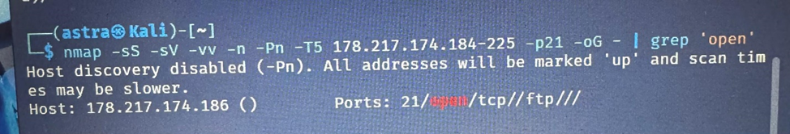
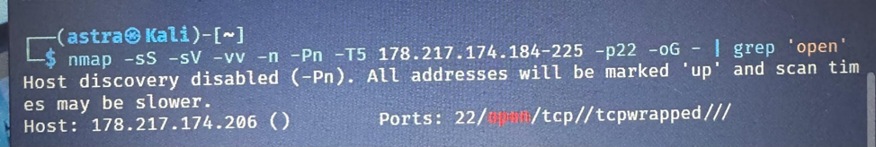
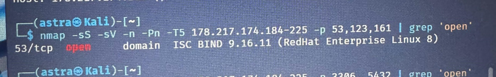
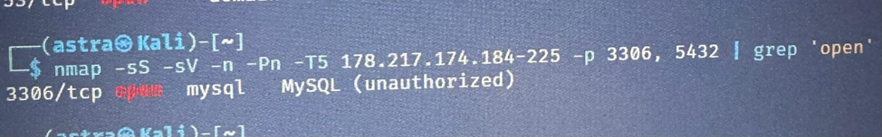
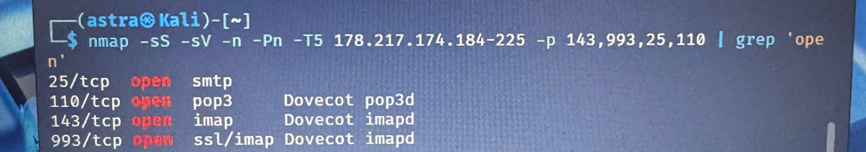

## Лабораторная работа №3

**Задача:** В Кали линукс, через nmap собрать данные сайта, пройтись по командам и  зафиксировать результаты

**1. Введем простую команду которая может использоваться для проверки доступен ли сайт Обращаем внимание на открытые порты.**

Информацию о хосте avn.kstu.kg (IP: 178.217.174.184).   
Основные детали:  
* Хост доступен с задержкой 0.0070 секунды.  
* 998 портов отфильтрованы (без ответа).  
* Открытые порты:  
  * 443/tcp (HTTPS).  
  * 8181/tcp (Intermapper). Блокирует фаервол

**2.Теперь введем команду которая позволяет пользователю проверить службы, запущенные на цели. Обратим внимание на то, что появился столбик VERSION — в нём указана версия программного обеспечения.**

* 995 портов отфильтрованы (без ответа). 
* Открытые порты:  
    * 81/tcp: tcpwrapped (версия не определена). 
    * 443/tcp: tcpwrapped (версия не определена). 
    * 3000/tcp: tcpwrapped (версия не определена). 
    * 3030/tcp: tcpwrapped (версия не определена). 
    * 8181/tcp: HTTP (Microsoft HTTPAPI httpd 2.0, использует SSDP/UPnP), ОС: Windows.

**3.Поиск роутеров, веб-серверов, веб-камер**

У роутеров, веб-серверов, веб-камер обычно открыты порты 80, 8080 и 1080. Просканировать эти порты и вывести только те адреса, на которых что-то открыто. сканируем порты с опциями -sS (стелс-сканирование), -sV (определение версий сервисов), -n (без разрешения имен), -Pn (отключение проверки доступности хоста), -T5 (агрессивный тайминг) и указанием диапазона IP-адресов 178.217.174.184-255 для портов 80, 8080 и 1080.

Обнаружены хосты с открытым портом 80/tcp (HTTP) и 8080 на следующих IP-адресах: 

**4.Поиск FTP**

Обычно FTP «висит» на 21 порту, поэтому используем предыдущую команду, только меняем сканируемый порт.

Обнаружен хост 178.217.174.186 с открытым портом 21/tcp, который ассоциируется с FTP (File Transfer Protocol).

(FTP (File Transfer Protocol) — это стандартный сетевой протокол, используемый для передачи файлов между хостами в сети. Порт 21 обычно используется для управления соединением (команды FTP))

**5.Поиск SSH**

Порт по умолчанию для SSH — 22, там и ищем.

Обнаружен хост 178.217.174.206 с открытым портом 22/tcp, но сервис помечен как "tcpwrapped". Это означает, что порт открыт, но доступ ограничен

**6.Сканирование UDP-портов (53, 123, 161)**

Порт 53/tcp используется для службы DNS (Domain Name System), которая отвечает за преобразование доменных имен. Хотя DNS традиционно работает по UDP на порту 53, некоторые реализации также поддерживают TCP для зональных трансферов или больших запросов. isc bind 9.16.11 — это конкретная версия сервера DNS от ISC (Internet Systems Consortium), известного как BIND (Berkeley Internet Name Domain). Версия 9.16.11 работает на платформе Red Hat Enterprise Linux 8, что говорит о том, что этот сервер запущен на данной ОС. другие порты (123 и 161) не были открыты или не определились из-за фильтрации, отсутствия ответа или ограничений сети.

**7.Сканирование портов для баз данных (3306, 5432)**

* Порт 3306/tcp: Это стандартный порт для MySQL. 
Nmap определил, что это MySQL, но не смог получить дополнительную информацию о версии или конфигурации, так как доступ к серверу ограничен 
* Порт 5432 (обычно используемый PostgreSQL) не упоминается в выводе, что означает, что он либо закрыт, либо отфильтрован

**8.Сканирование портов для почтовых сервисов (25, 110, 143, 993):**

* Проверить открытые порты для SMTP (25), POP3 (110), IMAP (143) и IMAPs (993).

